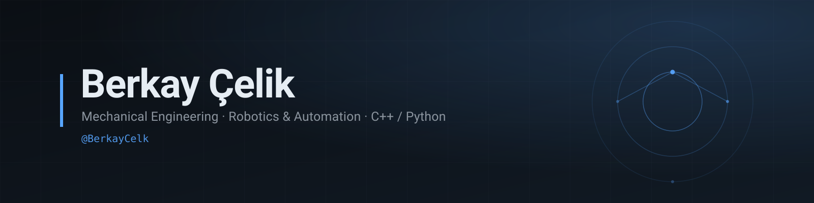

  <picture>
    <source media="(prefers-color-scheme: dark)" srcset="assets/banner-dark.svg">
    <source media="(prefers-color-scheme: light)" srcset="assets/banner-light.svg">
    
  </picture>

Mechanical engineering student in İzmir, Türkiye. I build small automation and data tools in Python, work in C/C++ on algorithms and low-level details, and I'm currently going deeper into modern C++ and ROS 2.

**Currently**
- 42 school C curriculum → modern C++
- Learning ROS 2 for robot software
- Building a data platform for Turkish IPOs *(private)*

**Selected work**
- **[Casting product defect classification](https://github.com/BerkayCelk/Casting-Product-Defect-Classification-using-CNN)** — CNN image classifier for casting defects (Python).
- **[42 C pool (c00–c07 + shell00)](https://github.com/BerkayCelk/42-c-pool)** — piscine C exercises, 54 functions from scratch.
- **[Libft](https://github.com/BerkayCelk/Libft)** — from-scratch reimplementation of parts of the C standard library.
- **[ft_printf](https://github.com/BerkayCelk/ft_printf)** — `printf` with format parsing and variadic arguments.
- **[get_next_line](https://github.com/BerkayCelk/get_next_line)** — buffered line-by-line reader with static state.
- **[push_swap](https://github.com/BerkayCelk/push_swap)** — two-stack sorting under a restricted instruction set: medium O(n·√n) chunk sort, simple O(n²) and complex O(n log n) radix sort algorithms + Makefile — *joint 42 project, working version in [push_swap-team](https://github.com/BerkayCelk/push_swap-team)*

**Toolbox**  
C++ · Python · C · Linux · Git — *currently learning:* ROS 2

**Contact**  
`berkaycelik2002@hotmail.com`
